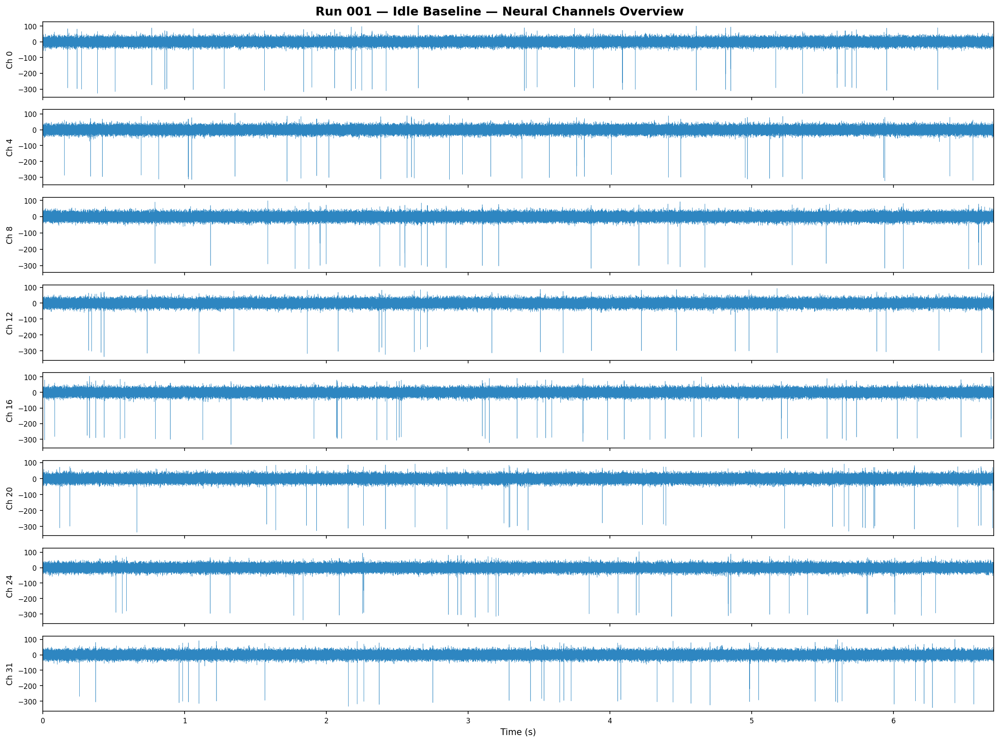

# Run 001 — Idle Baseline

**Date:** 2026-04-10 14:29:40  
**Duration:** 6.7 seconds  
**Mode:** Easy Training (Peripheral 104)  
**Purpose:** Establish baseline neural signal with controller connected but idle.

## Setup
- Controller plugged into SciFi via USB (B-button hold pairing)
- No joystick movement or button presses during recording
- 35 channels recorded at 32 kHz

## Results
- **Neural channels (0–31):** Active noise floor, std ~17, range ~[-340, +110]
- **Label channels (32–34):** All zeros — confirms no controller input detected

## Files
- `metadata.json` — full per-channel statistics
- `neural_channels.png` — 8 sampled neural channel time-series

## Neural Channels Overview

