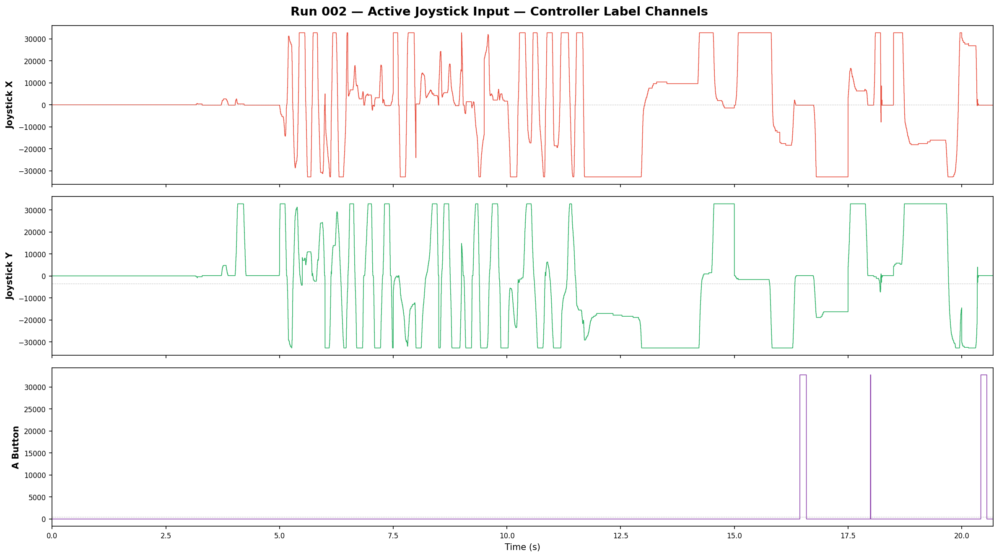
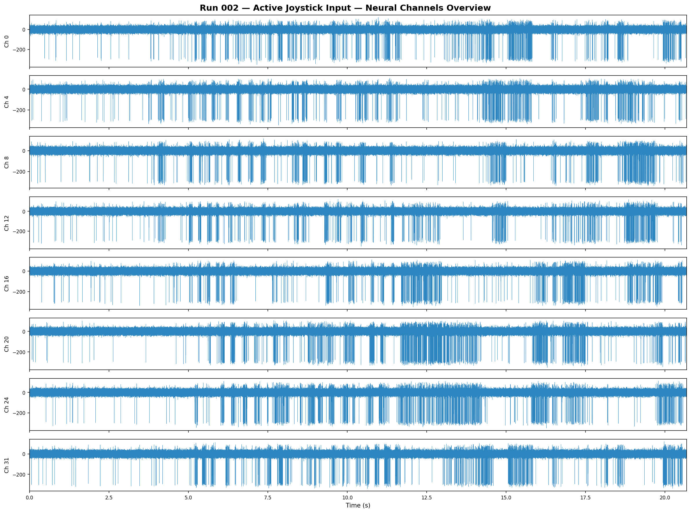
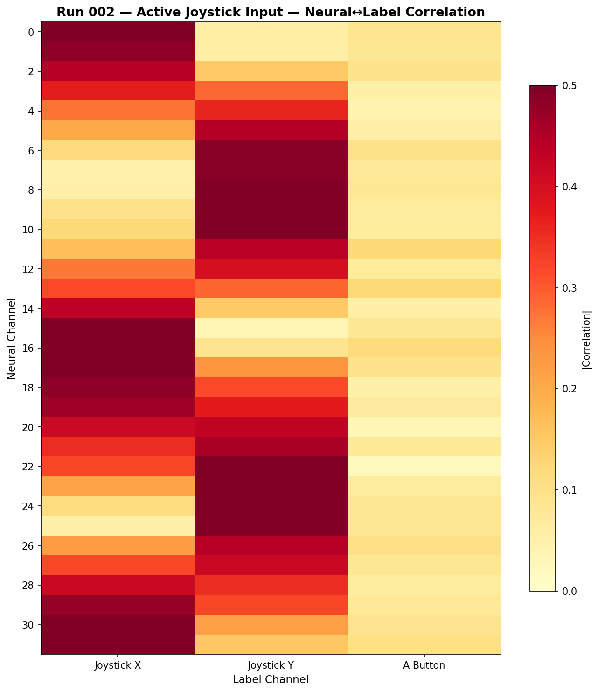

# Run 002 — Active Joystick Input

**Date:** 2026-04-10 14:30:32  
**Duration:** 20.7 seconds  
**Mode:** Easy Training (Peripheral 104)  
**Purpose:** Collect labeled training data with active controller input.

## Setup
- Controller plugged into SciFi via USB (B-button hold pairing)
- Active left joystick movement: all directions, sweeps, holds
- A button pressed intermittently
- 35 channels recorded at 32 kHz

## Results
- **Neural channels (0–31):** Higher variance than idle (std ~25 vs ~17), encoding is working
- **Ch 32 — Joystick X:** Continuous axis, range [-32767, +32767], 250 unique values
- **Ch 33 — Joystick Y:** Continuous axis, range [-32767, +32767], 253 unique values
- **Ch 34 — A Button:** Binary, values [0, 32767]

## Key Finding
The neural channels visibly change with controller input — the mock encoder is modulating the neural data based on joystick state. This confirms the decoder task is feasible.

## Files
- `metadata.json` — full per-channel statistics
- `neural_channels.png` — 8 sampled neural channel time-series
- `label_channels.png` — joystick X, Y, and A button ground truth
- `correlation_heatmap.png` — which neural channels correlate with which inputs

## Label Channels

## Neural Channels Overview

## Neural↔Label Correlation

