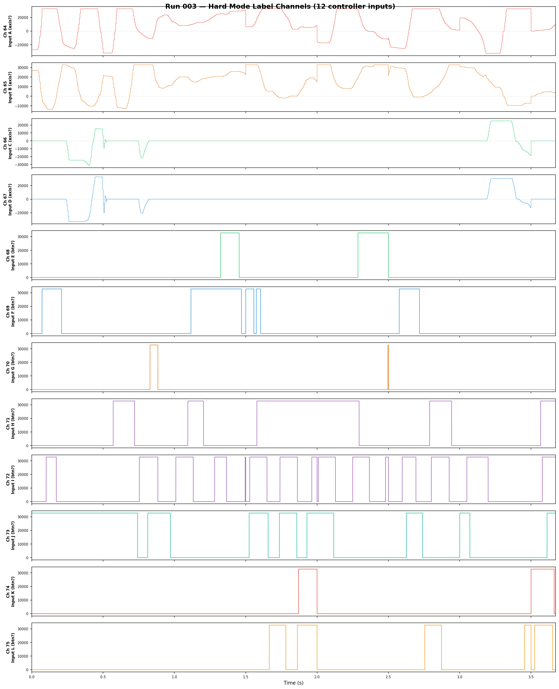
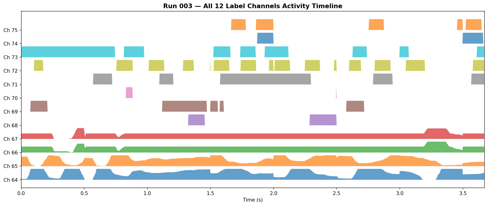
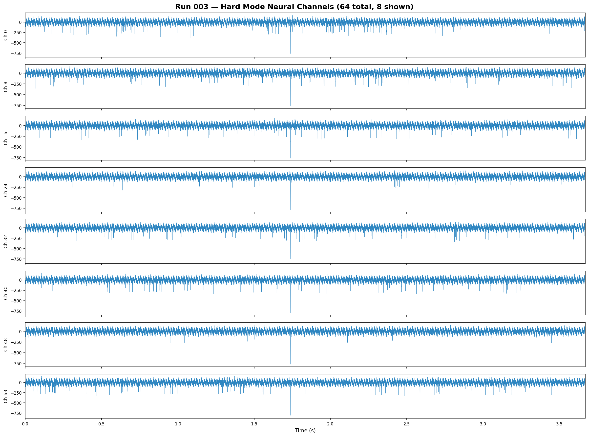
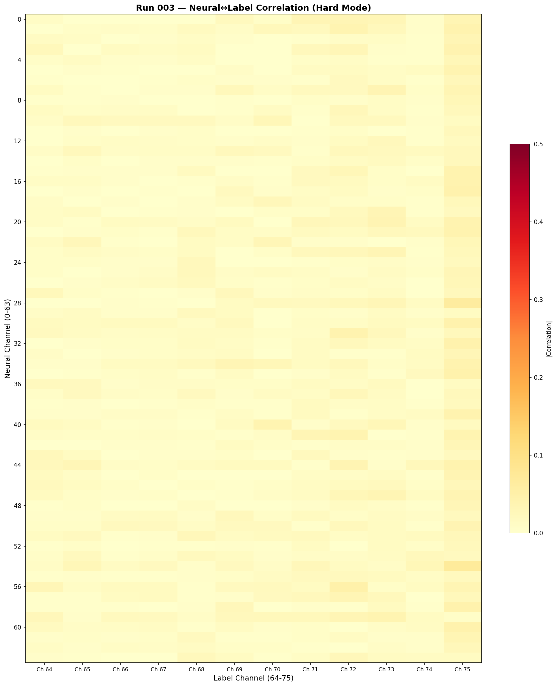

# Run 003 — Hard Mode, All Inputs

**Date:** 2026-04-10 14:45:48  
**Duration:** 3.7s effective (30s recorded, 62% packet loss)  
**Mode:** Hard Training (Peripheral 108)  
**Purpose:** Identify all 12 label channels with every controller input active.

## Setup
- Hard mode training (peripheral 108): 64 neural + 12 label channels = 76 total
- UDP buffers increased to 4MB to reduce packet loss
- All controller inputs used simultaneously (unstructured exploration)

## Channel Layout Discovered

| Channel | Type | Range | Likely Input |
|---------|------|-------|-------------|
| 0–63 | Neural | ~[-790, +165] | Encoded mock brain data |
| 64 | Axis (194 vals) | [-32767, +32767] | Joystick axis |
| 65 | Axis (157 vals) | [-13749, +32767] | Joystick axis |
| 66 | Axis (78 vals) | [-31225, +25314] | Joystick axis |
| 67 | Axis (65 vals) | [-32767, +32767] | Joystick axis |
| 68 | Button (binary) | [0, 32767] | Button |
| 69 | Button (binary) | [0, 32767] | Button |
| 70 | Button (binary) | [0, 32767] | Button |
| 71 | Button (binary) | [0, 32767] | Button |
| 72 | Button (binary) | [0, 32767] | Button |
| 73 | Button (binary) | [0, 32767] | Button |
| 74 | Button (binary) | [0, 32767] | Button |
| 75 | Button (binary) | [0, 32767] | Button |

> **Note:** Exact mapping (which channel = which input) is part of the challenge.  
> Next run will isolate each input one at a time to identify the mapping.

## Known Issues
- 62% packet loss — WiFi bandwidth limitation with 76 channels at 32kHz
- Only 3.7s of effective data from 30s recording

## Visualizations

### All 12 Label Channels

### Activity Timeline

### Neural Channels (8 of 64 shown)

### Neural↔Label Correlation Heatmap

