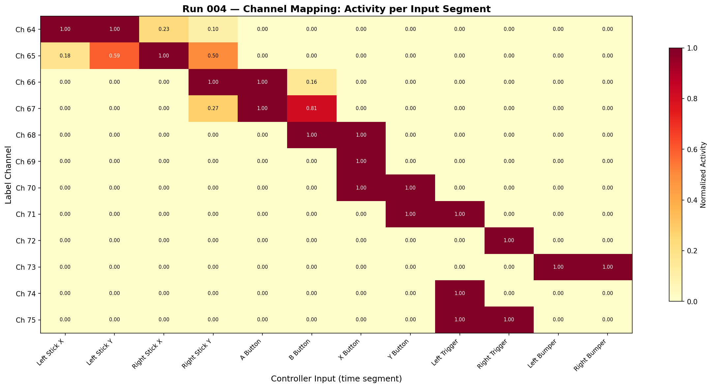
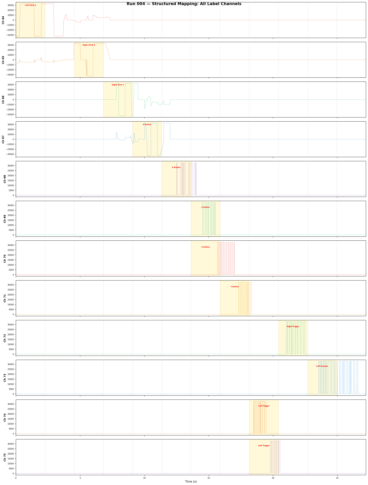

# Run 004 — Structured Channel Mapping

**Date:** 2026-04-10 15:18:48  
**Duration:** 27.2s effective (60s recorded, 55% packet loss)  
**Mode:** Hard Training (Peripheral 108)  
**Purpose:** Map each label channel to a specific controller input by activating one input at a time.

## Protocol
Each input was activated alone for ~5 seconds in sequence:
1. Left Stick X → 2. Left Stick Y → 3. Right Stick X → 4. Right Stick Y →
5. A → 6. B → 7. X → 8. Y → 9. LT → 10. RT → 11. LB → 12. RB

## Results

### Confident Mappings
| Channel | Input | Confidence |
|---------|-------|------------|
| Ch 64 | Left Stick X | High |
| Ch 65 | Right Stick X | High |
| Ch 66 | Right Stick Y | Good |

### Uncertain Mappings
The 55% packet loss compressed 60s → 27.2s of actual data, causing segment
boundaries to shift. Button mappings (Ch 68-75) did not align cleanly with
their intended time segments.

### Needs Follow-Up
- A second mapping run closer to the WiFi router (to reduce packet loss)
- Or: individual short recordings per input (5s each, separate files)

## Channel Mapping Heatmap

## All Label Channels (Segmented)

