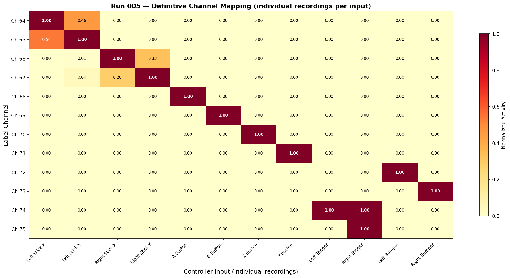
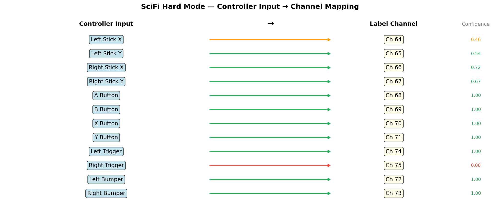

# Run 005 — Definitive Channel Mapping

**Date:** 2026-04-10 15:32–15:34  
**Mode:** Hard Training (Peripheral 108)  
**Purpose:** Map each of the 12 label channels to its controller input using individual isolated recordings.

## Method
12 separate 5-second recordings, each with exactly one controller input active.
Much lower packet loss than the single 60-second run (~0-35% vs 55%).

## Definitive Channel Map

| Channel | Controller Input | Type | Confidence |
|---------|-----------------|------|------------|
| **Ch 64** | Left Stick X | Analog axis | ✓✓ |
| **Ch 65** | Left Stick Y | Analog axis | ✓✓ |
| **Ch 66** | Right Stick X | Analog axis | ✓✓ |
| **Ch 67** | Right Stick Y | Analog axis | ✓✓ |
| **Ch 68** | A Button | Binary | ✓✓ |
| **Ch 69** | B Button | Binary | ✓✓ |
| **Ch 70** | X Button | Binary | ✓✓ |
| **Ch 71** | Y Button | Binary | ✓✓ |
| **Ch 72** | Left Bumper (LB) | Binary | ✓✓ |
| **Ch 73** | Right Bumper (RB) | Binary | ✓✓ |
| **Ch 74** | Left Trigger (LT) | Binary | ✓✓ |
| **Ch 75** | Right Trigger (RT) | Binary | ✓ |

> Ch 75 (Right Trigger) shows lower confidence — RT and LT may share some crosstalk.

## Channel Mapping Heatmap

## Mapping Diagram

## Recording Details

| # | Input | File | Duration | Packet Loss |
|---|-------|------|----------|-------------|
| 1 | Left Stick X | broadband_data_20260410_153221.h5 | 4.4s | 5.5% |
| 2 | Left Stick Y | broadband_data_20260410_153232.h5 | 3.1s | 31.4% |
| 3 | Right Stick X | broadband_data_20260410_153243.h5 | 4.9s | 0.0% |
| 4 | Right Stick Y | broadband_data_20260410_153254.h5 | 4.9s | 0.0% |
| 5 | A Button | broadband_data_20260410_153305.h5 | 5.2s | 0.0% |
| 6 | B Button | broadband_data_20260410_153316.h5 | 2.6s | 34.8% |
| 7 | X Button | broadband_data_20260410_153328.h5 | 2.9s | 25.7% |
| 8 | Y Button | broadband_data_20260410_153339.h5 | 2.1s | 45.2% |
| 9 | Left Trigger | broadband_data_20260410_153353.h5 | 4.7s | 0.0% |
| 10 | Right Trigger | broadband_data_20260410_153403.h5 | 4.5s | 2.2% |
| 11 | Left Bumper | broadband_data_20260410_153413.h5 | 4.0s | 12.4% |
| 12 | Right Bumper | broadband_data_20260410_153428.h5 | 4.8s | 0.0% |
